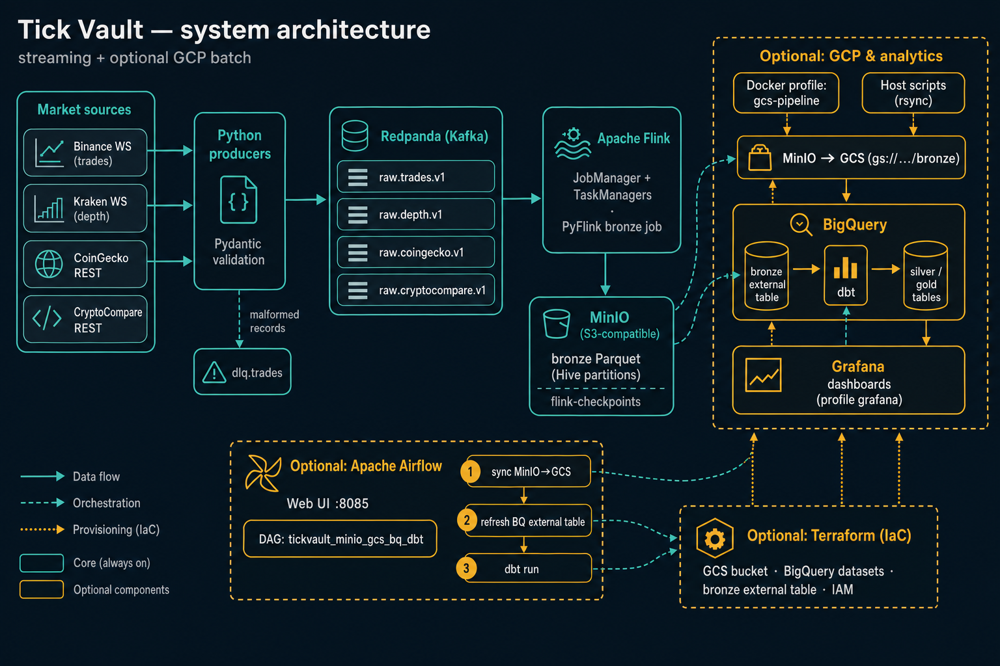
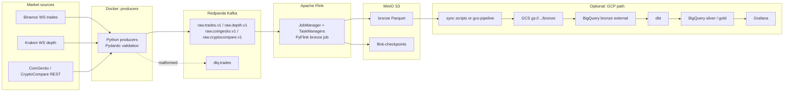

# tick-vault

Crypto market microstructure pipeline: consume raw order book snapshots and trade ticks over WebSockets, land every event in **bronze** (Parquet), then aggregate to **OHLCV**, bid–ask **spread**, and **volatility** in **silver/gold** via **dbt**. The gold mart feeds **Grafana** trading-style dashboards. Phases **1–5** below follow that curriculum. **Optional:** declarative GCP (**Terraform**) and scheduled batch steps (**Apache Airflow**) are documented at the end—they are **not** part of the numbered phases.

## Architecture



Earlier diagrams: [with tool badges](docs/tick-vault-architecture-tools.png) · [without badges](docs/tick-vault-architecture.png).



## Phase 1 — Environment setup & source connection

**Goal:** Live exchange connectivity into Kafka with contracts and resilience.

**Tasks (in repo):**

- Docker Compose stack for Redpanda, Flink, and MinIO
- Python producers for:
  - Binance trade stream
  - Kraken order book stream
  - CoinGecko and CryptoCompare REST quotes (optional; enabled by default)
- Pydantic schema contracts at producer ingestion
- DLQ routing on malformed payloads
- Redpanda topic bootstrap:
  - `raw.trades.v1`
  - `raw.depth.v1`
  - `raw.coingecko.v1`
  - `raw.cryptocompare.v1`
  - `dlq.trades`

**Tools:** Python 3.11+, **websockets**, **kafka-python**, **Pydantic**, Docker Compose, `.env`.

**Deliverable:** Valid ticks and depth snapshots on Redpanda topics; malformed payloads routed to **`dlq.trades`**; reconnect with exponential backoff on WebSocket drops.

## Quickstart

1. Copy env file:
   - `cp .env.example .env`
2. Start stack:
   - `docker compose up --build`
   - **Optional (GCP):** after `gcloud auth application-default login` (or service-account auth in `~/.config/gcloud`) and `GCP_PROJECT_ID` / `GCS_BUCKET` in `.env`, bring the stack up **with** the GCS profile so a one-shot job syncs bronze when Parquet exists and registers BigQuery: `docker compose --profile gcs up --build -d`. Re-run the job any time with `docker compose --profile gcs run --rm gcs-pipeline`. See **Phase 2**.
3. Verify services:
   - Redpanda Console: `http://localhost:8080`
   - Flink UI: `http://localhost:8081`
   - MinIO Console: `http://localhost:9001` (minioadmin/minioadmin)

## Project structure

- `docker-compose.yml` - local streaming stack orchestration
- `docker/` - producer and Flink Dockerfiles
- `docker/flink/` - Flink image (Kafka + Parquet + S3/GS plugins) and bronze job submit script
- `scripts/create_topics.py` - topic bootstrap utility
- `scripts/validate_bronze_offsets.py` - compare Kafka high-water sums to Parquet/BigQuery counts
- `scripts/sync_bronze_minio_to_gcs.sh` - mirror MinIO bronze Parquet to GCS for BigQuery
- `scripts/bronze_to_gcs_and_bq.sh` - sync (skips empty upload by default) + `phase2_gcp_bootstrap.sh`
- `docker/gcs-pipeline/` - image used by Compose **profile `gcs`** (`gcs-pipeline` service) for the same flow inside Docker
- `scripts/test_gcs_bronze_connection.sh` - verify `GCP_PROJECT_ID` / `GCS_BUCKET` from `.env` and list `gs://…/bronze/`
- `scripts/phase2_gcp_bootstrap.sh` - BigQuery datasets + bronze external table (no MinIO sync; pair with `sync_bronze_minio_to_gcs.sh` or `bronze_to_gcs_and_bq.sh`)
- `scripts/dbt_run_pipeline.sh` - `dbt deps` + `dbt run` for schedulers (Airflow); interactive checks stay in `dbt_build.sh`
- `scripts/dbt_build.sh` - `dbt debug` + `dbt build` with optional `.env` and local `dbt/profiles.yml`
- `.github/workflows/dbt.yml` - CI: `dbt parse` and docs with empty catalog
- `docker/grafana/` - Grafana provisioning (BigQuery datasource template + sample dashboard)
- `infra/gcs/` - GCS lifecycle (90-day bronze prefix) helper
- `infra/bigquery/` - medallion dataset bootstrap (`apply_datasets.sh`), `apply_bronze_external_table.sh`, and console DDL (`bronze_external_tables.sql`)
- `terraform/` - **Optional** IaC: GCS bucket, BigQuery datasets, bronze external table, IAM (see `terraform/README.md`)
- `airflow/` - **Optional** Apache Airflow stack + DAG `tickvault_minio_gcs_bq_dbt` (see `airflow/README.md`)
- `dbt/` - BigQuery medallion transforms (silver staging, gold mart) and docs
- `src/producers/` - websocket ingestion workers and schemas
- `src/flink_jobs/` - PyFlink streaming jobs

**Consolidation (fewer top-level docs/scripts):** the old **`PAIRS_README.md`** table now lives under **`TESTING_README.md`** (§5, *Reference pairs*). **`scripts/phase2_upload_and_bootstrap.sh`** was removed—use **`SKIP_GCS_UPLOAD_IF_NO_PARQUET=0 ./scripts/bronze_to_gcs_and_bq.sh`** for a forced rsync. **`infra/bigquery/create_medallion_datasets.sql`** was removed—use **`./infra/bigquery/apply_datasets.sh`** or optional **`terraform/`** instead.

## Data contracts

- `TradeEvent`:
  - venue, symbol, trade_id, event_ts_ms, price, quantity, is_buyer_maker, ingest_ts
- `OrderBookEvent`:
  - venue, symbol, update_id, event_ts_ms, bids, asks, ingest_ts
- `RestQuoteEvent` (CoinGecko / CryptoCompare):
  - venue (`coingecko` or `cryptocompare`), symbol, quote_id, event_ts_ms, price_usd, ingest_ts, raw_event
- `DlqEvent`:
  - source, reason, raw_payload, ingest_ts

All payloads are validated via Pydantic before publishing to the primary raw topics.

### Phase 1 message flow

```text
Binance WS (trade stream) ----\
                                > producers service --> Pydantic validation --> raw.trades.v1 (Redpanda)
Kraken WS (order book) -------/                                |
CoinGecko REST -------------+--> raw.coingecko.v1               |
CryptoCompare REST ---------+--> raw.cryptocompare.v1           |
                                                               +--> dlq.trades (malformed events)

topic-init -----------> creates required topics before producers start
console -------------> inspect topics/messages at localhost:8080
minio + minio-init --> bucket `tick-vault` (S3A sink target for local bronze)
flink jm/tm ---------> PyFlink bronze job (submit via `flink-submit-bronze` service)
```

### Phase 1 — active components

- Live Binance and Kraken websocket consumption
- Periodic CoinGecko and CryptoCompare USD quotes (HTTP), when enabled in `.env`
- Producer-side schema validation and normalization
- Publish valid records to `raw.trades.v1`, `raw.depth.v1`, `raw.coingecko.v1`, and `raw.cryptocompare.v1`
- Route invalid payloads to `dlq.trades`
- Retry + exponential backoff on websocket disconnect

### Prepared for next phases

- **Phase 2** — Flink bronze Parquet sink; optional GCS sync; BigQuery external bronze.
- **Phase 3** — dbt silver/gold (OHLCV, spread, volatility mart).
- **Phase 4** — Data quality (dbt tests, anomaly flags, freshness, DLQ metrics).
- **Phase 5** — Grafana dashboards and alerting (provisioned from JSON).

## Phase 2 — Bronze layer (streaming Parquet sink; GCS & BigQuery)

**Local vs GCP:** MinIO is your **S3-compatible object store** inside Docker (`s3a://tick-vault/...`). **BigQuery cannot read MinIO** (no `s3a://` or private MinIO endpoint for native external tables). For local development, bronze data lives only in MinIO until you copy it to **GCS** or load it into BigQuery some other way. Google Cloud here is mainly **BigQuery datasets + dbt** for silver/gold; a **GCS bucket is only required** if you want BigQuery **external** tables over Parquet (`gs://…`), which matches production Flink.

**Local:** Flink reads `raw.trades.v1` and `raw.depth.v1`, writes **Hive-style** Parquet under `s3a://tick-vault/bronze/` (MinIO), partitioned by **`dt` / `symbol` / `exchange`** (UTC calendar date from `event_ts_ms`, path-safe symbol, venue as exchange). Checkpoints land under `s3a://tick-vault/flink-checkpoints/`.

### Verify MinIO bronze data

With the stack running (`docker compose up -d` including MinIO), list objects under the `tick-vault` bucket:

```bash
docker run --rm --network host --entrypoint /bin/sh minio/mc:RELEASE.2024-08-26T10-49-58Z \
  -c 'mc alias set local http://127.0.0.1:9000 minioadmin minioadmin && mc ls -r local/tick-vault/bronze | head -50'
```

Or open **MinIO Console** at `http://localhost:9001` (same credentials as in `docker-compose.yml`), bucket **tick-vault**, prefix **bronze/**.

**Submit the job** (JobManager and TaskManagers must already be up):

- `docker compose up -d minio minio-init redpanda topic-init flink-jobmanager flink-taskmanager`
- `docker compose --profile bronze run --rm flink-submit-bronze` (detached `flink run -d`; job keeps running on the cluster; profile avoids auto-submit on every `docker compose up`)

**One bronze job per cluster:** each `flink-submit-bronze` run starts another `bronze_parquet` job. Only one should write to the same sink and checkpoint paths; extra jobs fight for resources and can sit in `RESTARTING` with failed tasks. Before submitting again, cancel stale jobs in the Flink UI (`http://localhost:8081`) or with `curl -X PATCH "http://localhost:8081/jobs/<jobId>?mode=cancel"` (use the job id from **Running Jobs**).

**Production:** set `BRONZE_SINK_BASE` / `CHECKPOINT_DIR` to `gs://...` on Flink and ensure the cluster has GCS credentials plus `flink-gs-fs-hadoop` on the classpath (already copied into this repo’s Flink image from `/opt/flink/opt`).

### GCP path from local MinIO (automated)

BigQuery bronze in this repo is an **external table** over **`gs://$GCS_BUCKET/bronze/*`** (with Hive partition discovery under that prefix), so GCS is part of the path whenever you use that pattern (local MinIO is still the Flink sink until you change `BRONZE_SINK_BASE`).

**A) Compose profile `gcs` (recommended when developing with Docker):**

1. Authenticate on the **host** so credentials live under `~/.config/gcloud` (for example `gcloud auth application-default login` and/or `gcloud auth login`). The `gcs-pipeline` container bind-mounts that directory **read-only** at `/gcloud-ro` and copies it into a writable `CLOUDSDK_CONFIG` inside the container so `gcloud` can update local state.
2. Set `GCP_PROJECT_ID` and `GCS_BUCKET` in `.env` (bucket name only, no `gs://`).
3. Optional: `GCS_PIPELINE_WAIT_SECONDS=120` in `.env` to wait before syncing (gives Flink/producers time after `compose up`).
4. Start the stack **with** the profile: `docker compose --profile gcs up --build -d`. The **`gcs-pipeline`** service runs once: mirror from MinIO, **upload to GCS only if at least one Parquet file exists** (otherwise it skips upload but still continues), then creates BigQuery datasets and the bronze external table.
5. Any time you need to push fresh bronze to GCS and refresh metadata: `docker compose --profile gcs run --rm gcs-pipeline`.

**B) Host scripts (same behavior, uses Docker only for `mc` unless `USE_LOCAL_MC=1`):**

1. Authenticate for GCS and BigQuery (`gcloud auth application-default login` or a service account with Storage write + BigQuery jobs/data admin as needed).
2. Put `GCP_PROJECT_ID` and `GCS_BUCKET` in `.env` (bucket name only, no `gs://`; avoid trailing spaces) or export them in your shell.
3. **Check GCS:** `./scripts/test_gcs_bronze_connection.sh` — reads `.env`, describes the bucket, and lists objects under `gs://$GCS_BUCKET/bronze/`.
4. **Sync + BigQuery in one step:** `./scripts/bronze_to_gcs_and_bq.sh` (skips GCS upload when the MinIO mirror has no Parquet unless you set `SKIP_GCS_UPLOAD_IF_NO_PARQUET=0`). For a forced rsync even when the mirror is empty, run `SKIP_GCS_UPLOAD_IF_NO_PARQUET=0 ./scripts/bronze_to_gcs_and_bq.sh`.
5. **Upload only:** `./scripts/sync_bronze_minio_to_gcs.sh` (optional: `MINIO_ENDPOINT`, `DOCKER_MC_NETWORK`, keys; Docker `mc` + `gcloud storage rsync` or `gsutil`).
6. **Datasets + external table only:** `./scripts/phase2_gcp_bootstrap.sh`.

Manual alternative: edit and run `infra/bigquery/bronze_external_tables.sql` in the console or `bq query`.

### Bronze Parquet columns (queryable + pruning keys)

| Column | Type (logical) | Notes |
| --- | --- | --- |
| `stream_kind` | string | `trades`, `depth`, `coingecko`, or `cryptocompare` |
| `payload` | string | Full JSON record from Redpanda (raw tick as published) |
| `exchange` | string | Same as producer `venue` (e.g. `binance`, `kraken`) |
| `symbol` | string | Path-safe symbol for partitions (`/` → `-`, `:` → `_`); full symbol remains inside `payload` |
| `event_ts_ms` | bigint | From payload when present |
| `ingest_ts` | string | ISO timestamp string from payload |
| `kafka_topic` | string | Kafka metadata |
| `kafka_partition` | int | Kafka metadata |
| `kafka_offset` | bigint | Kafka metadata (use for offset reconciliation) |
| `kafka_ts` | timestamp(3) | Kafka record timestamp |
| `dt` | string | `yyyy-MM-dd` partition key (UTC) |

**GCP**

- Lifecycle (delete objects under `bronze/` older than 90 days): `./infra/gcs/apply_lifecycle_bronze.sh gs://YOUR_BUCKET`
- BigQuery external table: use `./infra/bigquery/apply_bronze_external_table.sh` after upload, or edit placeholders in `infra/bigquery/bronze_external_tables.sql` and run manually.

**Validation**

- `pip install -r requirements-bronze-tools.txt`
- `python scripts/validate_bronze_offsets.py --kafka-bootstrap localhost:19092 --parquet-s3-prefix s3://tick-vault/bronze` (optional `--bigquery-table project.dataset.table`)

Offsets are approximate: Kafka retention/compaction, Flink at-least-once duplicates, and lag while the job catches up can all skew counts.

**Phase 2 deliverable:** Hive-partitioned bronze Parquet (**`dt` / `symbol` / `exchange`**) queryable in BigQuery via an **external table** once objects live on **`gs://…/bronze/`** (local Docker defaults to **MinIO** + sync; production Flink can sink **directly to GCS** with `BRONZE_SINK_BASE=gs://…`). Optional **90-day** raw retention: `./infra/gcs/apply_lifecycle_bronze.sh`.

## Phase 3 — Silver & gold (dbt transformations)

Medallion models read the bronze external table (`tickvault_bronze`), materialize silver in `tickvault_silver`, and the Grafana-ready mart in `tickvault_gold`. Override dataset names or project with dbt `--vars` (see `dbt/dbt_project.yml`).

**Prerequisites**

- BigQuery datasets exist (for example `tickvault_bronze`, `tickvault_silver`, `tickvault_gold`) and your principal can create tables in the silver and gold datasets. Create them with **`./infra/bigquery/apply_datasets.sh`**, optional **`terraform/`**, or the BigQuery console (see **Setup**).
- For `dbt run` as shipped, the **bronze** layer must exist as a **BigQuery** table (the `bronze.tickvault_bronze` source). With MinIO-only local bronze, use **Phase 2** upload + `apply_bronze_external_table.sh` (or the SQL file) after Parquet is on **GCS**, or maintain an equivalent native table yourself. The same principal then needs **Storage Object Viewer** on that GCS prefix if you use an external table.

**Setup**

- `pip install -r requirements-dbt.txt`
- `export GCP_PROJECT_ID=...` (and auth). Create datasets: `./infra/bigquery/apply_datasets.sh` (optional `BQ_LOCATION`, defaults to `US` to match `dbt/profiles.yml`) or optional **`terraform/`** (see `terraform/README.md`).
- Copy `dbt/profiles.yml.example` to `~/.dbt/profiles.yml`, or copy it to `dbt/profiles.yml` and run dbt with `DBT_PROFILES_DIR` pointing at the `dbt/` directory. Use `dev_oauth` (`gcloud auth application-default login`) or set `target: dev_sa` and export `GCP_PROJECT_ID` and `GOOGLE_APPLICATION_CREDENTIALS` (absolute path to the SA JSON) before `dbt` (`.env` is not read automatically unless you source it).
- Export `GCP_PROJECT_ID` if you prefer not to pass `gcp_project_id` via `--vars`.

**Run**

- From repo root: `./scripts/dbt_build.sh` (sources `.env` if present; uses `dbt/profiles.yml` when `DBT_PROFILES_DIR` is unset and that file exists). For **Apache Airflow** (optional appendix), the DAG calls **`./scripts/dbt_run_pipeline.sh`**. Or: `cd dbt && dbt run` then `dbt test`.
- Models built: `stg_trades`, `stg_depth`, `int_ohlcv_1m`, `int_depth_1m`, and `fct_market_metrics` (partitioned by `metric_date`, clustered by `symbol` and `exchange`).
- Documentation: `cd dbt && dbt docs generate` (with credentials, BigQuery fills `catalog.json`). Without warehouse access: `dbt parse && dbt docs generate --no-compile --empty-catalog`. Then `dbt docs serve`.

**Deliverable:** Full medallion dbt project; gold **`fct_market_metrics`** partitioned and clustered for Grafana. dbt docs can be generated locally or in CI (parse/docs without warehouse).

Gold mart columns include `metric_ts`, `metric_date` (partition), `open`, `high`, `low`, `close`, `volume`, `vwap`, `spread_bps` (from `int_depth_1m` when the venue publishes book snapshots), `volatility` (15-minute rolling stdev of log close returns), `volatility_60m`, and supporting mid price fields for spread QA.

## Phase 4 — Data quality checks

**Goal:** Catch bad or stale upstream data before it pollutes dashboards; surface pipeline health in the mart.

**In repo:**

- **dbt tests** on staging and marts: `not_null`, **`unique`** / **`unique_column_combination`** (e.g. `stg_trades` grain on `trade_id` + `event_ts`; surrogate keys on Kafka identity).
- **Anomaly-style flags** in **`int_ohlcv_1m`**: **`price_spike_flag`** (close deviates more than 10% from a 5-minute rolling average), **`zero_volume_flag`**, composite **`anomaly_flag`**—propagated to **`fct_market_metrics`**.
- **Freshness SLA** on the bronze source: **`dbt/models/staging/_sources.yml`** defines **`error_after: 5 minutes`** on **`kafka_ts`**. `./scripts/dbt_build.sh` runs **`dbt source freshness`**; by default a stale source **warns** unless you set **`STRICT_DBT_FRESHNESS=1`** to fail the build.
- **DLQ monitoring:** **`int_dlq_1m`** aggregates DLQ topic traffic; **`dead_letter_count`** on **`fct_market_metrics`** for Grafana and alerts.
- **Producer “schema drift” at the edge:** invalid WebSocket payloads are rejected by **Pydantic** and routed to **`dlq.trades`**; bronze uses custom **`required_json_fields`** tests on JSON payloads for trades vs depth rows.

**Gaps vs a strict CI gate:** `.github/workflows/dbt.yml` runs **`dbt parse`** and **`dbt docs generate --empty-catalog`**, not **`dbt test`** against BigQuery. Great Expectations is not wired in (optional in many curricula).

## Phase 5 — Grafana dashboards & reporting

**Goal:** Trading-style views on the gold mart, provisioned from code.

**In repo:**

- **Grafana** via `docker compose --profile grafana up -d grafana` → **`http://localhost:3000`** (default `GF_ADMIN_PASSWORD` or `admin`; anonymous Admin is **local convenience only**—see `docker/grafana/README.md`).
- **BigQuery** datasource plugin; JWT (or your org’s auth) configured in the UI after provisioning templates.
- **Dashboards (JSON under `docker/grafana/dashboards/`):**
  - **`tickvault-overview.json`** — live OHLC candlestick and volume-style views.
  - **`tickvault-spread-vwap.json`** — bid–ask spread and VWAP vs mid.
  - **`tickvault-volatility-heatmap.json`** — volatility by time × symbol.
  - **`tickvault-pipeline-health.json`** — DLQ counts, freshness-style signals, row counts.
  - **`tickvault-debug.json`** — extra diagnostics for development.
- **Alerting:** `docker/grafana/templates/alerting.yaml` includes a **DLQ threshold** rule (templated; wire `DLQ_ALERT_THRESHOLD` / datasource in Compose as documented in `docker/grafana/README.md`).

**Deliverable:** Dashboards load on `compose up` with provisioning; DLQ alert can fire when recent **`dead_letter_count`** exceeds the configured threshold (after BigQuery auth is completed).

### End-to-end checklist (Phases 1–5)

1. `docker compose up -d` (producers, Flink, MinIO; submit bronze with `--profile bronze` when ready).
2. Confirm Parquet under MinIO (`bronze/` prefix).
3. `export GCP_PROJECT_ID=... GCS_BUCKET=...` → `./scripts/bronze_to_gcs_and_bq.sh` (or `SKIP_GCS_UPLOAD_IF_NO_PARQUET=0 ./scripts/bronze_to_gcs_and_bq.sh` if you need an rsync attempt while bronze is still empty).
4. Copy `dbt/profiles.yml.example` to `dbt/profiles.yml` (or `~/.dbt/profiles.yml`), set project and auth → `./scripts/dbt_build.sh`.
5. `docker compose --profile grafana up -d grafana` → add BigQuery JWT → open the Tick Vault dashboards.

## Optional — Terraform & Apache Airflow (operations)

These tools are **not** part of the numbered Phases 1–5; they automate GCP provisioning and repeat the bronze→GCS→BigQuery→dbt path.

### Terraform (GCP IaC)

Use **`terraform/`** to declare the **GCS bucket**, **BigQuery** medallion datasets (`tickvault_bronze`, `tickvault_silver`, `tickvault_gold` by default), the **bronze Hive-partitioned external table** over `gs://…/bronze/*`, and optional **IAM** for a pipeline service account. Complements **`infra/bigquery/`** scripts.

**Typical flow:** `cd terraform && cp terraform.tfvars.example terraform.tfvars` → edit → `terraform init && terraform apply` → set **`GCS_BUCKET`** in `.env` → continue with **Phase 2** sync and **Phase 3** dbt. Details: **`terraform/README.md`**.

### Apache Airflow (batch orchestration)

DAG **`tickvault_minio_gcs_bq_dbt`** runs **sync MinIO→GCS**, **`apply_bronze_external_table.sh`**, and **`scripts/dbt_run_pipeline.sh`**. Default schedule **`@hourly`**; override with **`TICKVAULT_AIRFLOW_SCHEDULE`**. From repo root (after **`DOCKER_GID`** export): `docker compose -f airflow/docker-compose.yml up --build -d` — UI **http://localhost:8085** (`admin` / `admin` by default). See **`airflow/README.md`** for prerequisites and security notes.

## Source docs

- [Binance WebSocket Streams](https://developers.binance.com/docs/binance-spot-api-docs/web-socket-streams)
- [Kraken API Center](https://docs.kraken.com/websockets/)
- [CryptoCompare API](https://min-api.cryptocompare.com/)

CoinGecko and CryptoCompare are wired into `raw.coingecko.v1` / `raw.cryptocompare.v1` and the Flink bronze union (`stream_kind` = `coingecko` / `cryptocompare`). dbt silver/gold models still filter trades and depth only; extend dbt if you want REST quotes in marts.
